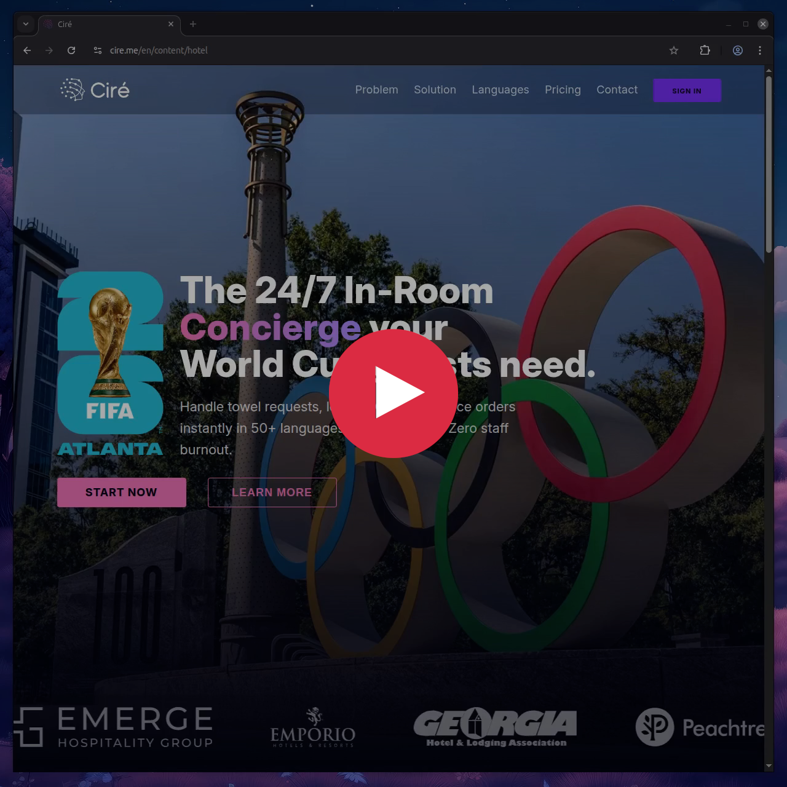

# Qwen-TTS for Pipecat

[](LICENSE)  [](https://github.com/pipecat-ai/pipecat)

**Qwen-TTS** is a custom Text-to-Speech service for [Pipecat](https://github.com/pipecat-ai/pipecat) powered by [Qwen3-TTS](https://github.com/QwenLM/Qwen3-TTS) via the DashScope real-time WebSocket API. Stream ultra-low-latency, natural-sounding speech directly into your voice agent pipeline — no GPU required.

<p align="center">
  <br/>
  <small>Pipecat × Qwen3-TTS</small>
</p>

## 🎯 Why Qwen-TTS?

| Feature | Benefit |
| :--- | :--- |
| **Sub-second latency** | First audio packet after a single character input — as low as 97ms end-to-end |
| **Streaming generation** | Real-time audio delta events over persistent WebSocket connection |
| **No GPU needed** | Cloud-hosted inference via Alibaba Cloud DashScope API |
| **Framework-aligned** | Built as a native `WebsocketTTSService` subclass — Pipecat handles text-to-context automatically |

## 🧱 Architecture

```
LLM Response → TTSTextFrame → QwenTtsService → WebSocket → DashScope API → AudioRawFrame
                                         ↑
                                    push_text_frames=True
                               (framework adds text to context)
```

Built with `push_text_frames=True`, the framework automatically pushes `TTSTextFrame` downstream so the LLM conversation context receives the assistant's spoken output. No manual frame plumbing required.

## 📦 Models & Pricing

| Model | ID | Use Case | Price (per 10,000 chars) |
| :--- | :--- | :--- | :--- |
| **TTS Flash** | `qwen-tts-flash` | Standard streaming TTS | $0.100 |
| **Instruct Flash** | `qwen3-tts-instruct-flash-realtime` | Natural language voice control + streaming (recommended default) | $0.115 |
| **Flash Realtime** | `qwen3-tts-flash-realtime` | High-performance streaming TTS | $0.130 |

All models use character-based billing with predictable per-character pricing.

## 🌐 Multi-Language Voice Support

Qwen TTS supports **10 international languages** with over 30 distinct voices — each voice can speak in any of these languages:

| Language | Code | Example Voices |
| :--- | :--- | :--- |
| **English** | `en` | Ethan, Bella, Neil, Vincent, Stella |
| **Chinese (Mandarin)** | `zh-CN` | Cherry, Serena, Kikyo, Mochi |
| **French** | `fr-FR` | Emilien, Nini, Sonrisa |
| **German** | `de-DE` | Lenn, Pia, Elias |
| **Russian** | `ru-RU` | Alek, Katerina, Maia |
| **Italian** | `it-IT` | Dolce, Bellona, Nofish |
| **Spanish** | `es-ES` | Bodega, Jennifer, Sunny |
| **Portuguese** | `pt-BR` | Ryan, Kikyo, Sohee |
| **Japanese** | `ja-JP` | Ono Anna, Momo, Pip |
| **Korean** | `ko-KR` | Sohee, Mia, Arthur |

Each voice is configurable via the `voice` parameter when instantiating the service. Dialect-specific voices (Cantonese, Shanghainese, Beijing, Sichuan, etc.) are also available.

## 🎬 Demo

<a href="https://cdn.cire.me/med/cire-demo.mp4" target="_blank"></a>

## ⚡ Quickstart

### Installation

```bash
pip install -e .
```

### Configuration

Export your DashScope API key:

```bash
export DASHSCOPE_API_KEY="sk-..."
```

### Usage in a Pipecat Pipeline

```python
from cire.services.qwen.realtime.tts import QwenTtsService
from pipecat.pipeline.transformer import LLMTranscriber

tts = QwenTtsService(
    api_key=DASHSCOPE_API_KEY,
    bot_user="Assistant",           # optional: identify calls in logs
    user_agent="cire/1.1.2",       # optional: client identifier
    model=QwenTtsModelType.QWEN3_TTS_INSTRUCT_FLASH_REALTIME,  # optional
)

pipeline = Pipeline([
    llm_service,
    tts,
    stt,
])
```

That's it. The WebSocket stays open across turns. The framework manages connection lifecycle, retries, and context injection.

### Constructor Parameters

| Parameter | Type | Default | Description |
|-----------|------|---------|-------------|
| `api_key` | `str` | *required* | DashScope API key |
| `bot_user` | `str \| None` | `None` | Bot username for log identification |
| `user_agent` | `str \| None` | `None` | Client identifier sent with WebSocket frames |
| `model` | `QwenTtsModelType` | `QWEN3_TTS_INSTRUCT_FLASH_REALTIME` | Which Qwen TTS model to use |
| `initial_prompt` | `str \| None` | `None` | System prompt for the realtime session |

## 🔌 Protocol Details

**Commit mode** — the service sends two types of buffer operations:

1. `input_text_buffer.append(text)` — accumulates text chunks
2. `input_text_buffer.commit()` — triggers generation

Audio arrives as `response.audio.delta` events — raw PCM audio frames streamed in real time.

## 🏗️ Project Structure

```
cire/
├── cire/
│   └── services/
│       └── qwen/
│           └── realtime/
│               ├── __init__.py
│               └── tts.py          # QwenTtsService implementation
├── pyproject.toml
├── LICENSE
└── README.md
```

## 📄 License

Apache 2.0 — see `LICENSE` for details.

## 🙏 Credits & Attribution

- **[Qwen3-TTS](https://github.com/QwenLM/Qwen3-TTS)** — speech generation models by Alibaba Group / Qwen Team
- **[Pipecat](https://github.com/pipecat-ai/pipecat)** — real-time voice & multimodal AI agent framework by Daily
- This service integrates Qwen3-TTS as a Pipecat `WebsocketTTSService` using the DashScope cloud API

## 🔗 Links

- **DashScope API docs**: [International](https://www.alibabacloud.com/help/en/model-studio/qwen-tts-realtime) · [Mainland China](https://help.aliyun.com/zh/model-studio/qwen-tts-realtime)
- **Pipecat docs**: https://docs.pipecat.ai
- **Pipecat Discord**: https://discord.gg/pipecat
